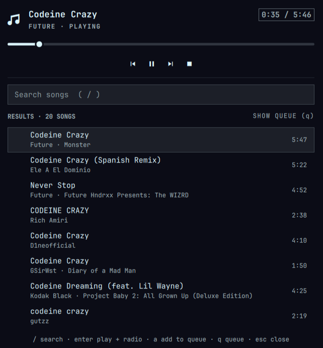

# OmaTune

[](https://github.com/codydon/omatune/actions/workflows/ci.yml)
[](LICENSE)
[](https://ko-fi.com/codydon)

OmaTune: search and play YouTube Music from the Omarchy bar, **without a Google
account**. It talks to YouTube Music's own InnerTube API as an
anonymous client, and it starts a song radio for whatever you pick, so the
music keeps going.



- Search songs from a panel in the bar
- Pick a song to play it now and fill the queue with its radio
- Add songs to the queue, jump around in it, remove songs from it
- Play/pause, next, back and seek from the panel, the bar or your media keys
- Background playback with no window, controlled from the bar
- No account, cookies or API key

## Requirements

| Package | Why |
|---|---|
| `mpv` | plays the audio |
| `yt-dlp` | resolves YouTube streams (mpv calls it) |
| `mpv-mpris` | media keys and the Omarchy media widget (optional but recommended) |
| `curl`, `jq` | InnerTube requests and parsing |
| `deno` | lets yt-dlp solve YouTube's JavaScript challenges |

```bash
omarchy pkg add mpv yt-dlp mpv-mpris jq deno
```

Keep **yt-dlp** up to date. When YouTube changes something, a yt-dlp update
is almost always the fix.

## Install

> **Manual setup:** OmaTune needs `mpv` and `yt-dlp` (and ideally
> `mpv-mpris`, `jq` and `deno`), which Omarchy doesn't ship by default.
> Install them first with the command above.

```bash
omarchy plugin add https://github.com/codydon/omatune --enable
omarchy restart shell
```

If the widget isn't in your bar afterwards, add `{ "id": "codydon.omatune" }`
to a section of `bar.layout` in `~/.config/omarchy/shell.json`.

## Update

```bash
omarchy plugin update codydon.omatune
omarchy restart shell
```

## Remove

```bash
omarchy-shell codydon.omatune stop      # stop the player first
omarchy plugin remove codydon.omatune
omarchy restart shell
```

Removing the plugin deletes its folder and stops mpv with it (the `stop`
line above just makes it immediate). The runtime folder
`$XDG_RUNTIME_DIR/codydon-omatune/` is in memory and goes away when you log
out. Nothing else is left behind: OmaTune writes no other files, and the
packages from Requirements stay installed.

## Use

**In the bar**

| Action | Does |
|---|---|
| Left click | Open the panel |
| Middle click | Play / pause |
| Right click | Next song |
| Scroll | Back / next |

The widget shows a note icon, plus the song title while something is
playing.

**In the panel**

| Key | Does |
|---|---|
| `/` or `s` | Search |
| `j` / `k` or arrows | Move through the list |
| `enter` / `space` | Play the song (search results also start its radio) or jump to it (queue) |
| `a` | Add the selected result to the queue |
| `q` | Switch between search results and the queue |
| `x` | Remove the selected song from the queue |
| `p` | Play / pause |
| `n` / `b` | Next / back (back restarts the song if it's past 3 seconds) |
| `h` / `l` | Seek 10 seconds back / forward |
| `esc` | In the search box: clear it, then leave it. Anywhere else: close the panel |

With the mouse: click a row to play it. Middle- or right-clicking a result
adds it to the queue, and doing the same on a queue row removes it.

## Settings

Change these in the Omarchy bar settings, or with `omarchy bar set`:

| Key | Default | Meaning |
|---|---|---|
| `showTitle` | `true` | Show the song title next to the icon |
| `maxTitleChars` | `28` | Longest title shown in the bar (8–80) |
| `autoRadio` | `true` | Queue the song's radio when you pick a search result |

```bash
omarchy bar set codydon.omatune maxTitleChars 40
```

## Keybindings and scripting

The plugin answers IPC calls on the target `codydon.omatune`:

```bash
omarchy-shell shell toggle codydon.omatune        # open/close on the focused monitor
omarchy-shell codydon.omatune playPause
omarchy-shell codydon.omatune next
omarchy-shell codydon.omatune previous
omarchy-shell codydon.omatune stop                # stop and close the player
omarchy-shell codydon.omatune search "daft punk"
omarchy-shell codydon.omatune playResult 0        # play the first result
```

Media keys already work through MPRIS (with `mpv-mpris` installed), so you
don't need bindings for play/pause/next.

## How it works

```
Panel / bar ──► Service.qml ──► ytm-backend ──► music.youtube.com/youtubei/v1  (search, radio)
                    │                └──────► starts / stops mpv
                    └──── JSON IPC socket ──► mpv ──► yt-dlp ──► audio stream
```

- **`ytm-backend`** sends InnerTube `search` and `next` requests as the
  signed-out `WEB_REMIX` client, the same one music.youtube.com uses when
  you aren't logged in. The replies are trimmed down to a short, checked
  track list.
- **yt-dlp** does the fragile work: stream URLs, signature decoding and
  bot-check tokens. The plugin doesn't reimplement any of it, so a yt-dlp
  update keeps it working.
- **mpv** plays audio with no window. The plugin starts it as its own
  child process the first time you play something, so it stops with the
  plugin (or the shell) and never outlives it.
  mpv's playlist *is* the queue.

### What it touches

- **Network:** `https://music.youtube.com/youtubei/v1/search` and `…/next`
  (search and radio), plus whatever stream URLs yt-dlp resolves for the song
  you play. No other hosts, and no data about you beyond what any signed-out
  visitor sends.
- **Files:** only `$XDG_RUNTIME_DIR/codydon-omatune/mpv.sock` (mpv's control
  socket), in a folder created mode 0700 and readable only by you. No logs,
  caches or settings files.
- **Processes:** one `mpv` (which runs `yt-dlp`), owned by the plugin. It
  starts when you first play something and stops with **Stop**, when the
  plugin is disabled or removed, or when the shell exits. Search and radio
  requests run as short-lived `curl` + `jq` helpers with a 25-second limit.
  All of them get a minimal environment, not your whole shell environment.
- **Config:** nothing. The plugin never edits `shell.json` or your Hyprland
  config; settings changes go through Omarchy's own settings API.

## Troubleshooting

| Symptom | Try |
|---|---|
| "Couldn't reach YouTube Music" | Check your connection. If YouTube Music isn't available in your region, you may need a VPN. |
| "Couldn't play …" | `yt-dlp -U` or update the package, then play the song again. |
| Search works but nothing plays | Play the song in a terminal to see the real error: `mpv --no-video https://music.youtube.com/watch?v=<id>` |
| "The player stopped unexpectedly" | Check `mpv --version` and `yt-dlp --version` work, then play the song again. |
| Widget missing or stale after an update | `omarchy restart shell` |
| Panel opens on the wrong monitor | Use `omarchy-shell shell toggle codydon.omatune` rather than `… codydon.omatune open`. |

Check the backend on its own:

```bash
./ytm-backend search "daft punk" | jq '.tracks[0]'
./ytm-backend radio wU26xVT_vBU | jq '.tracks | length'
```

## Limitations

- No thumbnails, offline downloads, local playlists or lyrics yet.
- No access to your personal YouTube Music library (likes, playlists).
  That would need signing in, which this plugin deliberately doesn't do.
- Restarting the shell stops the music (mpv belongs to the plugin, so it
  can never be left running on its own).

## Support

OmaTune is free and open source. If it's part of your day, you can support
its development on Ko-fi:

**[ko-fi.com/codydon](https://ko-fi.com/codydon)**

Starring the repository, reporting bugs and sending fixes help just as much.

## Contributing

Bug reports, fixes and features are welcome. Start with
[CONTRIBUTING.md](CONTRIBUTING.md): it covers the dev setup, how the code
fits together, the security rules every change follows, and how to run the
checks (`bin/check`). Please report security issues privately; see
[SECURITY.md](SECURITY.md). Everyone taking part follows the
[Code of Conduct](CODE_OF_CONDUCT.md).

## Note

This is an unofficial client, and it isn't affiliated with or endorsed by
YouTube or Google. Using it may go against YouTube's Terms of Service, as
with ArchiveTune, NewPipe and similar apps. It's meant for personal use.

## License

[MIT](LICENSE) © codydon and OmaTune contributors
