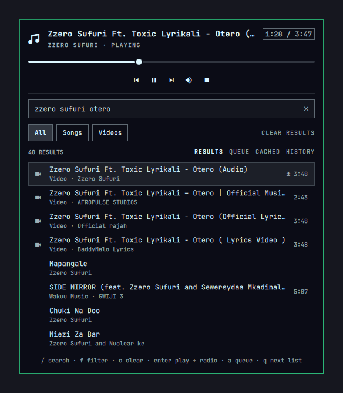

# OmaTune

[](https://github.com/codydon/omatune/actions/workflows/ci.yml)
[](LICENSE)
[](https://ko-fi.com/codydon)

OmaTune: search and play YouTube Music from the Omarchy bar, **without a Google
account**. It talks to YouTube Music's own InnerTube API as an
anonymous client, and it starts a song radio for whatever you pick, so the
music keeps going.



- Search songs from a panel in the bar
- Pick a song to play it now and fill the queue with its radio
- Add songs to the queue, jump around in it, remove songs from it
- Play/pause, next, back and seek from the panel, the bar or your media keys
- **Search history** you can re-run, forget or clear
- **Your queue survives restarts**: it comes back where you left off, and
  resumes from the same second when you press play
- **Offline cache**: songs you listen to are saved (up to a size you pick)
  and play from disk, even without a connection
- Background playback with no window, controlled from the bar
- Automatically scans `~/Music` for local audio and plays it through the same queue
- **Works out of the box on Omarchy**: nothing extra to install
- No account, cookies or API key

## Requirements

Nothing to install on Omarchy. Everything OmaTune uses ships with it:

| Package | Why |
|---|---|
| `mpv` | plays the audio |
| `yt-dlp` | resolves YouTube streams (mpv calls it) |
| `mpv-mpris` | media keys and the Omarchy media widget |
| `curl`, `jq`, `python` | InnerTube requests, parsing, and the storage helper |

**Optional:** installing `deno` lets yt-dlp solve YouTube's JavaScript
challenges. Without it, playback works today, but yt-dlp warns that this
mode is deprecated, so a future YouTube change could need it.

Keep **yt-dlp** up to date (`omarchy update` does it). When YouTube changes
something, a yt-dlp update is almost always the fix.

## Install

```bash
omarchy plugin add https://github.com/codydon/omatune --enable
omarchy restart shell
```

If the widget isn't in your bar afterwards, add `{ "id": "codydon.omatune" }`
to a section of `bar.layout` in `~/.config/omarchy/shell.json`.

## Update

```bash
omarchy plugin update codydon.omatune
omarchy restart shell
```

## Remove

```bash
omarchy-shell codydon.omatune stop      # stop the player first
omarchy plugin remove codydon.omatune
omarchy restart shell
```

Removing the plugin deletes its folder and stops mpv with it (the `stop`
line above just makes it immediate). The runtime folder
`$XDG_RUNTIME_DIR/codydon-omatune/` is in memory and goes away when you log
out.

**What stays after removal:** your saved data, in two folders only
OmaTune writes to:

| Folder | Holds |
|---|---|
| `~/.local/state/codydon-omatune/` | `history.json` (searches) and `queue.json` (saved queue) |
| `~/.cache/codydon-omatune/audio/` | saved songs (`<id>.webm` / `<id>.m4a`) and their titles (`<id>.json`) |

To remove that data too, use **CLEAR HISTORY** and **CLEAR OFFLINE SONGS**
in the panel before removing the plugin, or delete those two folders
yourself afterwards. (If you've set `XDG_STATE_HOME` or `XDG_CACHE_HOME`,
the folders are under those instead.)

## Use

**In the bar**

| Action | Does |
|---|---|
| Left click | Open the panel |
| Middle click | Play / pause |
| Right click | Next song |
| Scroll | Back / next |

The widget shows a note icon, plus the song title while something is
playing.

**In the panel**

| Key | Does |
|---|---|
| `/` or `s` | Search |
| `j` / `k` or arrows | Move through the list |
| `enter` / `space` | Results: play and start a radio · Queue: jump to it · Local: play · Cached: play from disk · History: search again |
| `a` | Add the selected result, local song or cached song to the queue |
| `q` | Next list: Results → Queue → Local → Cached → History |
| `3` | Show the local library scanned from `~/Music` |
| `1` `2` `3` `4` `5` | Go straight to Results, Queue, Local, Cached or History |
| `x` | Queue: remove the song · History: forget the search |
| `p` | Play / pause |
| `m` | Mute / unmute (the header shows MUTED) |
| `n` / `b` | Next / back (back restarts the song if it's past 3 seconds) |
| `h` / `l` | Seek 10 seconds back / forward |
| `esc` | In the search box: clear it, then leave it. Anywhere else: close the panel |

With the mouse: click a row to play it, and click the list names to switch.
Middle- or right-clicking a result adds it to the queue, and doing the same
on a queue row removes it. Songs marked 󰇚 are saved and play from disk.

**While typing in the search box**, YouTube suggests completions: `↓` / `↑`
to pick one, `enter` to search it, `tab` to complete it into the box, `esc`
to clear. Typing two or more characters is enough; short input never leaves
your machine.

**After a restart** the queue view shows your **saved queue**, and the header
says where it will resume. Nothing plays until you press play or pick a
song.

## Settings

Change these in the Omarchy bar settings, or with `omarchy bar set`:

| Key | Default | Meaning |
|---|---|---|
| `showTitle` | `true` | Show the song title next to the icon |
| `maxTitleChars` | `28` | Longest title shown in the bar (8–80) |
| `autoRadio` | `true` | Queue the song's radio when you pick a search result |
| `saveHistory` | `true` | Remember your searches |
| `cacheSongs` | `true` | Save songs you listen to for 20 seconds for offline play |
| `cacheLimitMB` | `1024` | Offline cache size in MB (100–20000); the oldest songs go first |

```bash
omarchy bar set codydon.omatune maxTitleChars 40
```

## Keybindings and scripting

The plugin answers IPC calls on the target `codydon.omatune`:

```bash
omarchy-shell shell toggle codydon.omatune        # open/close on the focused monitor
omarchy-shell codydon.omatune playPause
omarchy-shell codydon.omatune toggleMute
omarchy-shell codydon.omatune next
omarchy-shell codydon.omatune previous
omarchy-shell codydon.omatune stop                # stop and close the player
omarchy-shell codydon.omatune search "daft punk"
omarchy-shell codydon.omatune playResult 0        # play the first result
```

Media keys already work through MPRIS (with `mpv-mpris` installed), so you
don't need bindings for play/pause/next.

## How it works

```
Panel / bar ──► Service.qml ──► ytm-backend ──► music.youtube.com/youtubei/v1  (search, radio)
                    ├──► ytm-store (Python) ──► history, saved queue, offline cache
                    └──── JSON IPC socket ──► mpv ──► yt-dlp ──► audio stream / saved file
```

- **`ytm-backend`** sends InnerTube `search` and `next` requests as the
  signed-out `WEB_REMIX` client, the same one music.youtube.com uses when
  you aren't logged in. The replies are trimmed down to a short, checked
  track list.
- **yt-dlp** does the fragile work: stream URLs, signature decoding and
  bot-check tokens. The plugin doesn't reimplement any of it, so a yt-dlp
  update keeps it working.
- **mpv** plays audio with no window. The plugin starts it as its own
  child process the first time you play something, so it stops with the
  plugin (or the shell) and never outlives it.
  mpv's playlist *is* the queue.

### What it touches

- **Network:** `https://music.youtube.com/youtubei/v1/search` and `…/next`
  (search and radio), plus whatever stream URLs yt-dlp resolves for the song
  you play. No other hosts, and no data about you beyond what any signed-out
  visitor sends.
- **Files:** mpv's control socket in `$XDG_RUNTIME_DIR/codydon-omatune/`,
  plus your data in `~/.local/state/codydon-omatune/` (search history and
  the saved queue) and `~/.cache/codydon-omatune/audio/` (saved songs). All
  three folders are created mode 0700 and every file 0600, readable only by
  you. They're created the first time something is saved; just loading the
  plugin writes nothing. See **Remove** for what stays behind.
- **Saved songs** are downloaded by `yt-dlp` from YouTube, one at a time in
  the background, after you've listened to a song for 20 seconds. Each is
  checked to be real audio, and the cache never grows past `cacheLimitMB`.
  Search history and offline saving can each be turned off in the settings.
- **Processes:** one `mpv` (which runs `yt-dlp`), owned by the plugin. It
  starts when you first play something and stops with **Stop**, when the
  plugin is disabled or removed, or when the shell exits. Search and radio
  requests run as short-lived `curl` + `jq` helpers with a 25-second limit,
  and file work runs in a small Python helper (`ytm-store`); a song download
  has a 5-minute limit and a 60 MB size cap.
  All of them get a minimal environment, not your whole shell environment.
- **Config:** nothing. The plugin never edits `shell.json` or your Hyprland
  config; settings changes go through Omarchy's own settings API.

## Troubleshooting

| Symptom | Try |
|---|---|
| "Couldn't reach YouTube Music" | Check your connection. If YouTube Music isn't available in your region, you may need a VPN. |
| "Couldn't play …" | Update yt-dlp (`omarchy update`), then play the song again. Saved songs still play offline. |
| A song isn't saved offline | It's saved after 20 seconds of listening, one at a time. Check `cacheSongs` is on and the Cached list's header for errors. |
| Search works but nothing plays | Play the song in a terminal to see the real error: `mpv --no-video https://music.youtube.com/watch?v=<id>` |
| "The player stopped unexpectedly" | Check `mpv --version` and `yt-dlp --version` work, then play the song again. |
| Widget missing or stale after an update | `omarchy restart shell` |
| Panel opens on the wrong monitor | Use `omarchy-shell shell toggle codydon.omatune` rather than `… codydon.omatune open`. |

Check the backend on its own:

```bash
./ytm-backend search "daft punk" | jq '.tracks[0]'
./ytm-backend radio wU26xVT_vBU | jq '.tracks | length'
```

## Limitations

- The local library scans `~/Music` recursively and supports common audio formats. It is rescanned when the panel opens; local queue entries do not survive a shell restart.
- No thumbnails, local playlists or lyrics yet.
- No access to your personal YouTube Music library (likes, playlists).
  That would need signing in, which this plugin deliberately doesn't do.
- Restarting the shell stops the music (mpv belongs to the plugin, so it
  can never be left running on its own), but the queue comes back and
  resumes where you were.

## Support

OmaTune is free and open source. If it's part of your day, you can support
its development on Ko-fi:

**[ko-fi.com/codydon](https://ko-fi.com/codydon)**

Starring the repository, reporting bugs and sending fixes help just as much.

## Contributing

Bug reports, fixes and features are welcome. Start with
[CONTRIBUTING.md](CONTRIBUTING.md): it covers the dev setup, how the code
fits together, the security rules every change follows, and how to run the
checks (`bin/check`). Please report security issues privately; see
[SECURITY.md](SECURITY.md). Everyone taking part follows the
[Code of Conduct](CODE_OF_CONDUCT.md).

## Note

This is an unofficial client, and it isn't affiliated with or endorsed by
YouTube or Google. Using it may go against YouTube's Terms of Service, as
with ArchiveTune, NewPipe and similar apps. It's meant for personal use.

## License

[MIT](LICENSE) © codydon and OmaTune contributors
